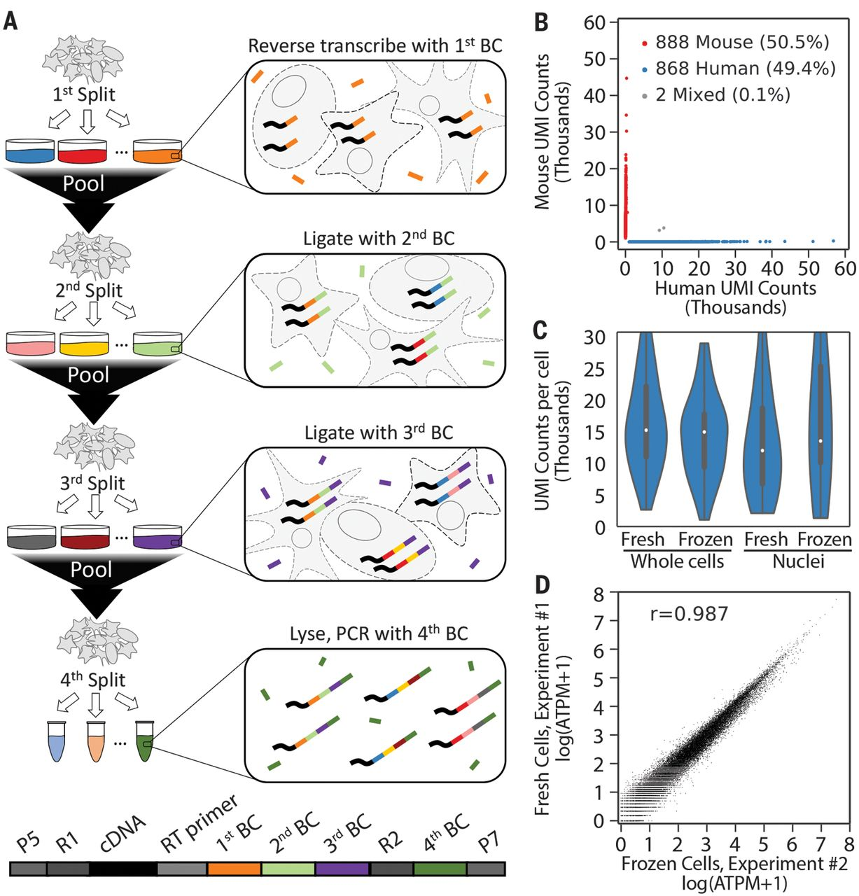

# Hackathon: `cellatlas`

## Objective

Update [cellatlas v0.0.0](https://github.com/cellatlas/cellatlas) to work with [seqspec v0.3.1](https://github.com/pachterlab/seqspec). The current release of `cellatlas` works with an in-between release of `seqspec` - which appears to be prior to `seqspec v.0.2.0` judging by the changelog.

## Resources

### cellatlas

| source |
| --- |
| [v0.0.0](https://github.com/cellatlas/cellatlas/tree/main/cellatlas) |
| **[this fork](https://github.com/gibberwocky/cellatlas/tree/main/cellatlas)** |

### seqspec

| source | specification | example YAML |
| --- | --- | --- |
| [v0.1.1](https://github.com/gibberwocky/cellatlas/tree/main/seqspec-source/v0.1.1/seqspec) | [v0.1.1](seqspec-specifications/v0.1.1/SPECIFICATION.md) | [v0.0.0](https://github.com/cellatlas/cellatlas/blob/main/examples/rna-splitseq/spec.yaml) |
| [v0.2.0](https://github.com/gibberwocky/cellatlas/tree/main/seqspec-source/v0.2.0/seqspec) | [v0.2.0](seqspec-specifications/v0.2.0/SPECIFICATION.md) | [v0.3.0](https://github.com/pachterlab/seqspec/blob/main/examples/specs/SPLiT-seq/spec.yaml) |
| [v0.3.1](https://github.com/gibberwocky/cellatlas/tree/main/seqspec-source/v0.3.1/seqspec) | [v0.3.1](seqspec-specifications/v0.3.1/SPECIFICATION.md) | |

The `v0.0.0` YAML is provided with the `cellatlas` SPLiTSeq example and works with the `seqspec` in-between release. The `v0.3.0` YAML should be the same specification as `v0.3.1` as the changelog indicates no changes to the specification.

A tutorial on generating the YAML for the SPLiTSeq [publication](https://www.science.org/doi/10.1126/science.aam8999) data is available [here](https://github.com/pachterlab/seqspec/blob/main/docs/TUTORIAL_COMPLEX.md).



## Maxwell setup

### Fork

To install the `cellatlas` fork and latest `seqspec`:

```bash
# Create conda environment
module load mamba
mamba create --name cellatlas_fork python=3.7
mamba activate cellatlas_fork
mamba install gget
mamba install kb-python
mamba install git pip
# Install cellatlas fork
pip install git+https://github.com/gibberwocky/cellatlas.git
# Install latest seqspec release
pip install git+https://github.com/pachterlab/seqspec.git
```

### Functional `cellatlas` + `seqspec`

To install a functional version of `cellatlas` and `seqspec` (i.e. the in-between release):

For reference, the
```bash
# Create conda environment
module load mamba
mamba create --name cellatlas python=3.7
mamba activate cellatlas
mamba install gget
mamba install kb-python
mamba install git pip
# Install cellatlas
pip install git+https://github.com/cellatlas/cellatlas.git
# Install in-between seqspec release
pip install git+https://github.com/pachterlab/seqspec.git@9471a317f524c289ee6582c1889cdeac0c5396b2
```

## Running `cellatlas`

Example how to run `cellatlas`:

```bash
# Create project folder
PROJECT=~/sharedscratch/test
mkdir ${PROJECT} && cd ${PROJECT}

# Download reference fasta and GTF from Ensembl
wget http://ftp.ensembl.org/pub/release-109/fasta/mus_musculus/dna/Mus_musculus.GRCm39.dna.primary_assembly.fa.gz
wget http://ftp.ensembl.org/pub/release-109/gtf/mus_musculus/Mus_musculus.GRCm39.109.gtf.gz

# Clone cellatlas repo for SPLiTseq data
git clone https://github.com/cellatlas/cellatlas.git

# Clone seqspec repo for SPLiTseq seqspec YAML
git clone https://github.com/pachterlab/seqspec.git

# Run cellatlas
cellatlas build -o ./out -m rna \
  -s ./seqspec/examples/specs/SPLiT-seq/spec.yaml \
  -fa Mus_musculus.GRCm39.dna.primary_assembly.fa.gz \
  -g Mus_musculus.GRCm39.109.gtf.gz \
  ./cellatlas/examples/rna-splitseq/fastqs/R1.fastq.gz ./cellatlas/examples/rna-splitseq/fastqs/R2.fastq.gz
```

**Note** | The fastq data contains `R1.fastq.gz` and `R2.fastq.gz`, while `spec.yaml` also refers to `I1.fastq.gz` - this file is not present in the `cellatlas` repo. The `spec.yaml` indicates this is a 6 bp i7 index, which is reported in the [documentation](https://github.com/pachterlab/seqspec/blob/main/docs/TUTORIAL_COMPLEX.md) to be identifiable in [Supplementary Table 12](https://www.science.org/doi/suppl/10.1126/science.aam8999/suppl_file/aam8999_tables12.xlsx) of the [Rosenberg et al. SPLiTseq paper](https://www.science.org/doi/10.1126/science.aam8999). In addition, the filenames for the barcodes are different (i.e. `./cellatlas/examples/rna-splitseq/barcode-1_onlist.txt.gz` is `onlist_round1.txt` in `spec.yaml`), require updating.

`cellatlas build` should return `./out/cellatlas_info.json`, which contains the commands to run the `kallisto-bustools` pipeline on Maxwell:

```bash
kb ref -i ./out/index.idx -g ./out/t2g.txt -f1 ./out/transcriptome.fa Mus_musculus.GRCm39.dna.primary_assembly.fa.gz Mus_musculus.GRCm39.109.gtf.gz 
kb count -i ./out/index.idx -g ./out/t2g.txt -x 1,10,18,1,48,56,1,78,86:1,0,10:0,0,140 -w /uoa/home/s14dw4/cellatlas-example/onlist_joined.txt -o out --h5ad -t 2 ./fastqs/R1.fastq.gz ./fastqs/R2.fastq.gz
```

The full `cellatlas` SPLiTSeq example for use with `seqspec v < 0.3.0` is available [here](https://github.com/cellatlas/cellatlas/blob/main/examples/rna-splitseq/preprocess.ipynb).
